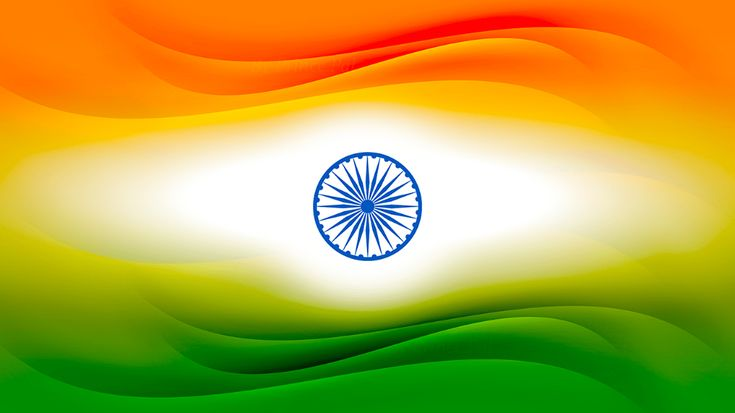

  

<h1 align="center"> Triranga</h1> 

  <b>A Tribute to the Indian Flag</b> 
  A simple yet elegant project built using <code>HTML</code> and <code>CSS</code> to honor the pride and spirit of India.  

  
  
  
  

# Introduction
Triranga is a beautifully designed HTML & CSS-based project created to showcase the essence and significance of the Indian National Flag. This project visually represents the colors, structure, and symbolism of the tricolor while maintaining a responsive and aesthetically pleasing design.

## Key Features:
✅ Pure HTML & CSS Implementation – No JavaScript required, ensuring simplicity and efficiency. 
✅ Responsive Design – Adapts to different screen sizes for a seamless viewing experience. 
✅ Animated Effects – Smooth CSS animations to enhance visual appeal. 
✅ Symbolic Representation – Displays the Saffron, White, and Green colors with the Ashoka Chakra. 
✅ Minimal & Clean UI – Designed with a modern yet patriotic look. 

Triranga is a tribute to India's rich heritage and unity, offering an engaging way to learn and appreciate the national flag through web development. 🚀
